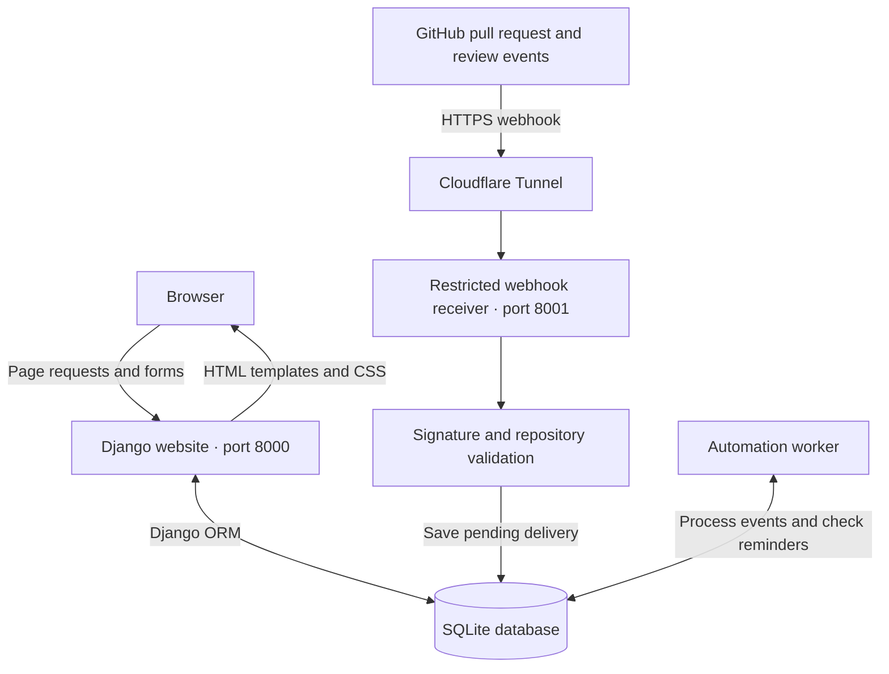
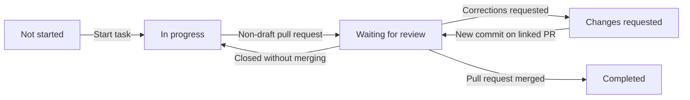

# 🔄 Teamflow

**GitHub-Integrated Task Management and Workflow Automation**

A Django web application that connects software-team tasks with GitHub pull requests, review decisions and merge events.

Teamflow brings task assignments, project boards, review reminders and activity history into one workspace. Signed GitHub events are stored in a database-backed queue and processed by a separate worker, allowing task updates to continue after a worker restart.

## 🏗️ Architecture



The website, receiver and worker are separate local processes that use the same database. Cloudflare Tunnel supplies a temporary public HTTPS address for webhook demonstrations.

### Task Workflow



This diagram shows the main journey. Recognized approval leaves a task waiting for a human merge; draft pull requests remain in progress.

## 📋 Task and Project Management

- User registration, login and logout through Django authentication.
- Workspaces with team-leader and team-member roles.
- Multiple projects with separate repository connections.
- Task creation with an assignee, a different reviewer and an optional due date.
- Five task statuses: **Not started**, **In progress**, **Waiting for review**, **Completed** and **Changes requested**.
- Project selection, title/TASK-ID search and an **Assigned to me** filter.
- Up to 10 tasks per status-column page, with navigation for additional tasks.
- Task history showing manual actions and automated updates.

### Access Controls

| Action | Who can perform it |
| --- | --- |
| Create or edit project settings and tasks | Team leader |
| Start a not-started task | Task assignee or team leader |
| Request corrections in Teamflow | Assigned reviewer, who must differ from the assignee |
| View project tasks | Members of the project's workspace |
| View webhook secrets and delivery details or retry deliveries | Team leader for that workspace |

Permissions are checked in the backend, in addition to controlling which buttons appear on screen.

## 🔗 GitHub Integration

### Connecting a Pull Request to a Task

Include the task's displayed ID in the pull-request **title or description**:

```text
TASK-8 Add a welcome message
```

For a new connection, Teamflow requires exactly one distinct task reference and checks that the task belongs to the connected project.

- The descriptive words do not need to match the task title.
- Initial matching does not read branch names, commit messages or ordinary PR comments.
- A title containing `TASK-3` and a description containing `TASK-4` require attention.
- Once linked, subsequent events use the saved task/PR association.
- A task can have only one linked pull-request record in this implementation.

### Event Handling

| GitHub event | Teamflow behavior |
| --- | --- |
| Non-draft PR opened, reopened or marked ready for review | Moves the linked task to Waiting for review |
| PR converted to draft | Moves the task to In progress |
| Assigned, mapped reviewer requests changes on the current commit | Moves the task to Changes requested |
| New commit on an open, non-draft linked PR | Returns the task to review; a changed commit starts a new review cycle |
| Assigned, mapped reviewer approves the current commit | Records approval and stops the pending-review timer; waits for merge |
| PR closed without merging | Moves the task to In progress |
| PR merged | Moves the task to Completed |

GitHub review events require the assigned reviewer to save their GitHub username under **Teams & people → People & profiles**. The current mapping is self-entered and does not verify GitHub account ownership through OAuth.

## ⚙️ Automation Worker

The custom `runworker` command performs recurring processing:

```text
Update worker heartbeat
          ↓
Read up to 100 pending deliveries
          ↓
Validate event context and apply task transitions
          ↓
Check tasks awaiting review
          ↓
Create due in-app reminders
          ↓
Wait approximately 10 seconds and repeat
```

### Processing Behavior

- Incoming events are stored before the receiver acknowledges them.
- Pending deliveries remain available if the worker stops and restarts.
- Unique project/delivery-ID pairs prevent repeated delivery records.
- Notification keys prevent repeated notifications within the corresponding workflow cycle.
- Older event timestamps are ignored to help preserve newer task state.
- A saved merged flag protects completed pull requests from later transitions.
- Review reminders use each project's configured delay.
- **Worker active** indicates a heartbeat less than 90 seconds old.

One worker serves all projects in the database. This SQLite demonstration is intended to run with a single worker; multi-worker concurrency is not verified.

## 🔔 Notifications, Reports and Delivery Tracking

### In-App Notifications

- Notify the assigned reviewer when work becomes ready for review.
- Notify the developer when corrections are requested.
- Remind the reviewer when the configured review delay passes.
- Allow the signed-in user to mark their notifications as read.

The initial review notification and the later reminder are separate messages. Reminders are limited to one per task/review cycle.

### Reports

- Task counts by status and completion percentage.
- Overdue unfinished tasks.
- Current pending-review wait times.
- Project filters and paginated review/overdue lists.
- CSV export with protection for selected spreadsheet-formula-leading characters.

The average review wait is calculated from currently pending reviews. It is not a historical average of completed reviews.

### Recent Deliveries

A separate page provides project filtering, processing outcomes and pagination of 30 deliveries per page. Leaders can retry failed deliveries or deliveries needing attention.

A retry processes the **saved payload**. It does not fetch a newly edited pull request from GitHub.

## 🛡️ Engineering Practices

- HMAC-SHA256 verification using the exact webhook request body.
- Repository matching before event acceptance.
- Restricted development receiver for webhook POST requests.
- Django authentication, CSRF protection for browser forms and permission checks.
- Form validation and workspace-scoped user choices.
- Database transactions for related workflow updates.
- Unique constraints for memberships, deliveries and PR associations.
- Automated regression tests using an isolated test database.
- SQLite backup restoration checks using integrity, schema and content comparisons.
- Local database files, secrets and virtual environments excluded from version control.

## 🛠️ Technology Stack

| Area | Technologies |
| --- | --- |
| Backend | Python, Django |
| Interface | HTML, CSS, Django templates; small inline JavaScript handlers |
| Database | SQLite, Django ORM |
| Automation | Custom Django management commands, database-backed event processing |
| Integration | GitHub webhooks, HTTP, JSON, HMAC-SHA256 |
| Local connectivity | Cloudflare Tunnel |
| Development tools | Git, GitHub, VS Code, Windows PowerShell, pip, Python virtual environments |

PostgreSQL configuration and drivers are present as an optional path. SQLite is the database used for the documented local setup.

## 📁 Repository Structure

Main application files and folders:

```text
Teamflow_Project/
├── README.md
├── RUN-TEAMFLOW-YOURSELF.md
├── requirements.txt
├── .env.example
├── .gitignore
├── manage.py
├── start.ps1
├── worker.ps1
├── config/
│   ├── settings.py
│   ├── urls.py
│   └── wsgi.py
├── flow/
│   ├── models.py
│   ├── forms.py
│   ├── views.py
│   ├── urls.py
│   ├── context.py
│   ├── services.py
│   ├── webhook_gateway.py
│   ├── migrations/
│   ├── tests.py
│   ├── test_access_boundaries.py
│   ├── test_board_paging.py
│   ├── test_corrections.py
│   ├── test_deliveries.py
│   ├── test_gateway.py
│   ├── test_reports.py
│   └── management/commands/
│       ├── runworker.py
│       ├── runwebhook.py
│       ├── seed_demo.py
│       ├── preview_notification_email.py
│       └── verify_sqlite_backup.py
├── templates/
│   ├── base.html
│   ├── board.html
│   ├── task.html
│   ├── reports.html
│   ├── integrations.html
│   └── deliveries.html
└── static/
    ├── app.css
    ├── board-refresh.css
    └── favicon.svg
```

This overview highlights the main components; the repository also contains authentication, team, form and activity templates and Python package marker files.

## 🚀 Run Locally on Windows

### Prerequisites

- Python 3.12 and Git.
- A terminal such as PowerShell; VS Code is optional.
- GitHub access and `cloudflared` only when testing live webhook integration.

### 1. Clone the Repository

```powershell
git clone https://github.com/GiriRaju9543/Teamflow_Project.git
cd Teamflow_Project
```

For a private repository, authenticate with an account that has access. If you already have the project locally, open that folder instead of cloning another copy.

### 2. Create the Virtual Environment

```powershell
py -3.12 -m venv .venv
```

### 3. Install Dependencies

```powershell
.\.venv\Scripts\python.exe -m pip install -r requirements.txt
```

### 4. Initialize the Database

```powershell
.\.venv\Scripts\python.exe manage.py migrate
```

### 5. Start the Website

```powershell
.\.venv\Scripts\python.exe manage.py runserver 127.0.0.1:8000
```

Open [Teamflow locally](http://127.0.0.1:8000/). Register an account and create a project. Teammates must register before a leader can add them to a workspace.

Commands explicitly select the virtual environment's Python, so activation is not required. Leave the server terminal running; use **Ctrl+C** to stop it.

### Optional Sample Data

On a local development setup, create labelled sample accounts and tasks:

```powershell
.\.venv\Scripts\python.exe manage.py seed_demo
```

Generated demo credentials are saved privately in `.local/demo-login.txt`. Sample completed/review records demonstrate the board; they are not evidence of actual GitHub activity.

## 🌐 Connect GitHub Webhooks

Keep the website running. Open three additional terminals in the same project folder.

### Terminal 2: Worker

```powershell
.\.venv\Scripts\python.exe manage.py runworker
```

### Terminal 3: Webhook Receiver

```powershell
.\.venv\Scripts\python.exe manage.py runwebhook
```

### Terminal 4: Tunnel

After installing `cloudflared`, run:

```powershell
cloudflared tunnel --url http://127.0.0.1:8001
```

### Repository Configuration

1. In Teamflow project settings, save the repository as `owner/repository`.
2. Open **GitHub & automation** and locate that project's webhook path and secret.
3. In the corresponding GitHub repository, open **Settings → Webhooks → Add webhook**.
4. Set **Payload URL** to the current tunnel address plus the project's webhook path.
5. Select **application/json** and paste the matching project secret into **Secret**.
6. Subscribe to **Pull requests** and **Pull request reviews**. Keep SSL verification enabled and the webhook active.
7. Inspect GitHub's ping delivery and Teamflow's **Recent deliveries** page.

A newly accepted event returns **202**. A repeated delivery ID returns **200** with a duplicate indicator. Acceptance means the event was stored; inspect its processing result to confirm what happened next.

Each project uses its own webhook path and secret. Update every affected **Payload URL** whenever Cloudflare supplies a new tunnel address.

## 🧪 Testing and Validation

```powershell
.\.venv\Scripts\python.exe manage.py check
.\.venv\Scripts\python.exe manage.py makemigrations --check --dry-run
.\.venv\Scripts\python.exe manage.py test
```

The documentation reconstruction verified **24 passing automated tests** on the 24 September 2026 source snapshot. Coverage includes access boundaries, workflow transitions, webhook validation, reminders, reports and pagination.

The source recovered from the build manual also passed the test suite. Tests use synthetic events and a separate test database; they do not prove production readiness or replace a live GitHub integration check. Rerun them after changes.

## 💾 Backup and Local Data

```powershell
.\.venv\Scripts\python.exe manage.py verify_sqlite_backup
```

The command creates a consistent SQLite backup, restores it into a separate test file and checks:

- SQLite integrity and foreign keys.
- Schema equality.
- All-table row counts and content hashes.

It does not replace the live database. Keep a separate private off-device copy for protection against drive loss.

Local data lives in `.local/teamflow.sqlite3`. A fresh clone does not contain the original installation's users, tasks or webhook connections. Preserve `.local` when moving your working installation; recreate `.venv` and reinstall dependencies at the new location.

`.env.example` lists available settings but is **not automatically loaded**. Actual settings must be supplied as environment variables where required.

## 📌 Current Scope

- Built and documented for local development and demonstrations.
- Permanent hosting and production server configuration are not included.
- Notifications are in-app; the email-preview command writes a local file and does not send real email.
- GitHub identity mapping is self-entered, not OAuth-verified.
- Equal event timestamps and malformed-payload edge cases need further hardening.
- Passing tests are not a full security audit or a load-testing result.

## 📚 Documentation

See [Run Teamflow Yourself](RUN-TEAMFLOW-YOURSELF.md) for additional operating instructions.

The project was developed with AI assistance and hands-on workflow testing as a practical learning exercise in Django, databases and GitHub automation.

## 👨‍💻 Author

**GiriRaju Gunna**

Python | Django | SQL | Web Development | Workflow Automation

[GitHub: GiriRaju9543](https://github.com/GiriRaju9543)

Explore the source, follow a task from assignment to merge, and run the local checks to understand how the components work together.

##

⭐ If you find this project useful, feel free to explore the notebooks and architecture.